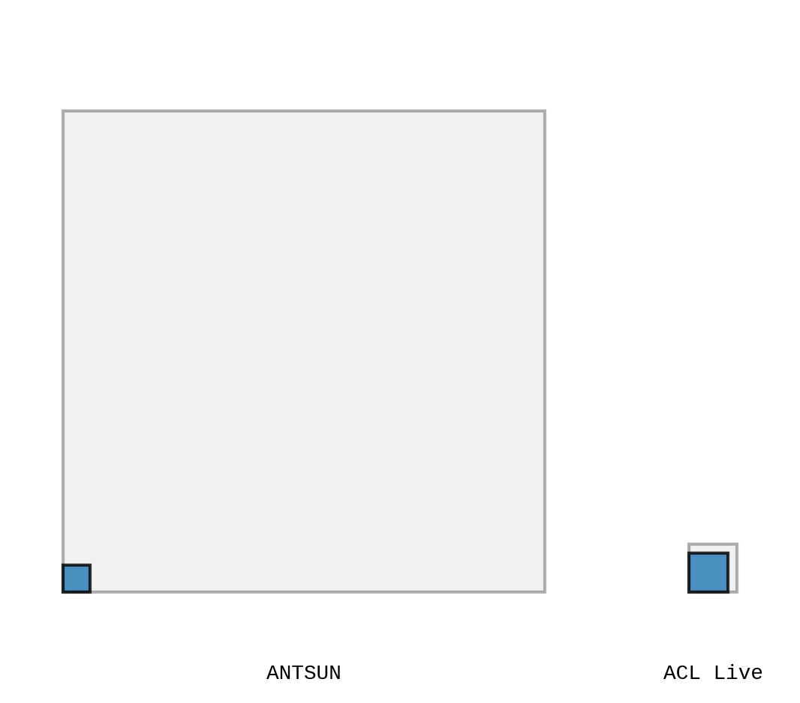
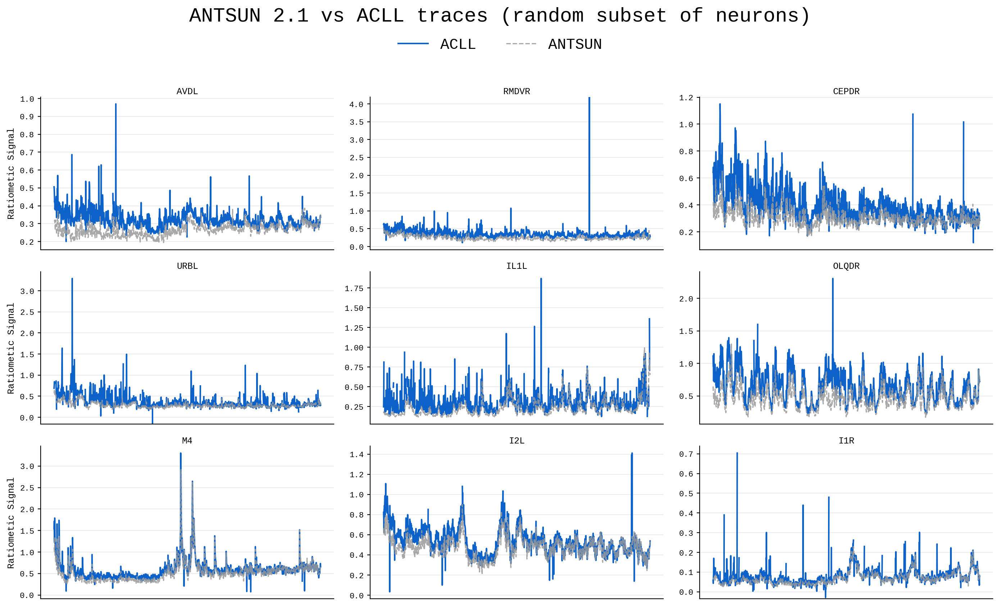

The following pipeline is adapated from AutoCellLabeler as implimented in:
- AutoCellLabeler based on [Deep Neural Networks to Register and Annotate the Cells of the *C. elegans* Nervous System](https://www.biorxiv.org/content/10.1101/2024.07.18.601886v1) Adam Atanas et al.

Which is in turn based on PyTorch implementation of 3D U-Net and its variants:

- Standard 3D U-Net based on [3D U-Net: Learning Dense Volumetric Segmentation from Sparse Annotation](https://arxiv.org/abs/1606.06650) 
Özgün Çiçek et al.

- Residual 3D U-Net based on [Superhuman Accuracy on the SNEMI3D Connectomics Challenge](https://arxiv.org/pdf/1706.00120.pdf) Kisuk Lee et al.

# AutoCellLabeler Live

ACLL is a **work in progress**. The current version of ACLL runs Binning, Shear Correction, Labeling, Channel Alignment, and Trace Extraction (BSLCT).

Future iterations will include:
- Intelligent cropping (to maximize the number of neurons in frame)
- ROI Filtering
- Bleach Correction

### Efficency
The ACLL approach of labeling each frame directly allows us to skip costly (and necessarily offline) alignment, performing the purpose of BrainAlignNet, SegNet, and AutoCellLabeler in tandem. This removes the need for the following parts of [ANTSUN 2.1](https://github.com/flavell-lab/ANTSUN):
- Euler Registration (6 hours)
- BrainAlignNet DDF Calculation (5 hrs)
- SegNet ROI Segmentation (1 hr)
- ROI Watersheding, Displacement & Non-rigid Pentalty Calculation (8 hrs)
- Freely Moving to Immobilized Registration (2-16 hrs)
- Multicolor Image Registration (1-3 hrs)
- Trace Extraction (< 1 hr)

It also directly implements and performs the function of the following sections:
- Shear Correction (2 hrs)
- Freely Moving Channel Alignment (< 1 hrs)
- Auto Cell Labeler Inference (5 min - on one frame)

Thus, assuming fastest ANTSUN 2.1 conditions, ACLL performs the equivalent of 27 hours of computation, in 32 minutes. Running timepoints simultanously can bring that down just over 16 minutes (16 minutes is our standard experiment duration).

*The area represents relative time, with internal squares showing the proportion of time actually running inference versus preparting to run it*

This being said, ACLL is not currently intended to replace ANTSUN (although Freely Moving ACL accuracy improvements can be compounded by aggregrating predictions across frames, allowing for accuracies matching ANTSUN's single frame, multi-color performance) and is intended to interogate the activity of pre-selected neurons in real time. This is important, since some neurons are labeled more consistently than others in freely moving frames, so smart selection can greatly boost usefulness. Luckily, there are plenty of high-accuracy neuron options.

*Six random traces show that even without ROI filtering or smoothing, ACLL accurately captures neural dynamics*

## The Pipeline
### Image Reading
To maxamize compatibility, the main way ACLL runs currently is by waiting for files to be created in a specified folder (`ACLL_folder_watcher.py`). At that point, it reads them to the GPU and begins processing. Depending on your setup, you may be able to cut down the overhead here (for example, Nikon provides JOBS, which in theory would allow one to directly pass the acquisitions to memory) but in practice, this isn't a very large overhead.

### Binning
For lab-specific compatibility reasons, our files must be binned before we process. This is done on the CPU as testing indicated the overhead of transfering 9 times as much data to the GPU was significantly larger than the slight ineffiency tradeoff we experience by running this on device. You will likely be able to skip this step.

### Shear Correction
As the worm moves around, the z-slices get sheared, and thus must be aligned before any processing can procede. However, it is possible that an ACLL network that was trained on unsheared data may not have this restriction - this is a current WIP. This process must happen on each z-slice, and currently happens in series, although it is concievable that pairing could vastly parrallelize the procedure. Given that it takes about 0.5 seconds, it's a potential avenue for optimization, and it is highly dependent on z-height, so intelligent cropping would also help speed this up.

### **FreelyMoving AutoCellLabel**
The core of this pipeline is an [AutoCellLabler](https://github.com/flavell-lab/AutoCellLabeler/tree/main) variant trained on freely-moving tagRFP-only data. In contrast to [established](https://www.biorxiv.org/content/10.1101/2024.07.18.601886v1) practices which use a single, post-recording, immobilized NeuroPAL (4-channel) volume to label, and then propogates those labels by aligning ROIs across timepoints, we directly label each timepoint. The main tradeoff is that we only have access to one channel, and while there is a massive increase (800-1600x) in training data in this regime, it is incredibly difficult to distinguish between similarly sized cells unless they have vastly different intensities. The labels are also impossible to validate directly (as this is an impossible task for a human) and must be ran though a NeuroPAL labeling and alignment procedure to validate.

### Channel Alignment
Since every imaging set up is likely to have at least some misalignment, we rigidly channel-align all the images. This misalignment should be consistent across a recording and can be calculated across the first several frames and then simply only applied to the rest of the frames. This is a major priority for speedup.

### Trace Extraction
Using the FM ACL labels, we threshold them, run a very naive filtration, and then calculate the ratiometric signal. This is a massive simplification of the ANTSUN signal-extraction process, but is also a blazingly fast procedure. This is likely a candidate for performance improvement, but not for speedup.

## Running
### `ACLL_folder_watcher.py`
This is the main file. Provide a folder to watch, a pytorch3dunet config file, and run. The traces will be saved to the provided file. It currently supports `nd2`, `nrrd`, and `h5` filetypes, although it should be incredibly easy to add more.

Example command:
`CUDA_VISIBLE_DEVICES=2 python ACLL_folder_watcher.py --config configs/py3dunetFMLivePredict.yaml`

A big TODO is to make the config file allow customized combinations of the components of ACLL, but currently it's only the config for the UNet

## Analysis
### `metrics/ACLL_quantify_on_test.py`
Allows you to provide filepaths to testing datasets (currently set up for the Flavell Lab's filesystem). It also takes an output folder to save traces too, but this is not indended to produce cohesive traces. Currently it is expected to hijack the prediction method and save an h5 for labeling analysis. In the future, it should be easier to save such intermediary checkpoints.

### `metrics/compare_traces.ipynb`
Graphs the ACLL-generated traces compared to another pipeline's (i.e. ANTSUN)

# TODOs
- Remove pytorch3dunet from here and fetch from fmACL
- chan align speedup